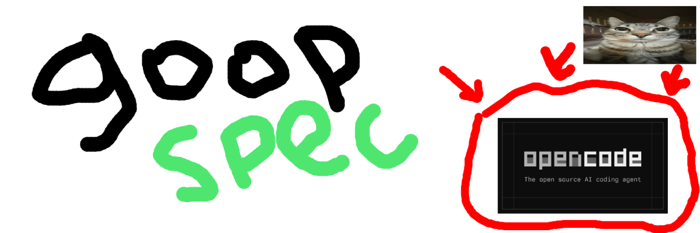

# GoopSpec

<p align="center">
  
</p>

**Stop the AI chaos. Ship what you actually want.**

[](https://github.com/hffmnnj/opencode-goopspec)
[](https://bun.sh)
[](https://www.typescriptlang.org/)
[](./TEST-SUMMARY.md)
[](./LICENSE)

---

You've been there. You ask an AI to build a feature. It starts coding immediately, misses half your requirements, forgets context mid-conversation, and delivers something that... works? But isn't what you wanted.

**GoopSpec fixes this.**

It's a spec-driven workflow for [OpenCode](https://opencode.ai) that forces clarity *before* code. You describe what you want, GoopSpec interviews you to uncover the edge cases, locks a specification you both agree on, then executes against that contract.

No more "that's not what I meant." No more scope creep. No more AI amnesia.

```
Discuss → Plan → Specify (lock it) → Execute → Accept (verify it)
```

---

## Philosophy

- **Ask, Don't Assume** — Interview first, code second
- **Spec as Contract** — Lock requirements before execution
- **Memory-First** — Learn from every project
- **Scale to the Task** — Quick fixes skip gates, big features get the full workflow

---

## The Workflow

```
  DISCUSS          PLAN           EXECUTE         AUDIT          CONFIRM
 ┌────────┐     ┌────────┐      ┌────────┐     ┌────────┐     ┌────────┐
 │  What  │     │  How   │      │  Build │     │ Verify │     │ Accept │
 │  do    │ ──▶ │  will  │ ──▶  │   it   │ ──▶ │   it   │ ──▶ │   it   │
 │  you   │     │  we    │      │        │     │        │     │        │
 │  want? │     │  do it?│      │        │     │        │     │        │
 └────────┘     └────────┘      └────────┘     └────────┘     └────────┘
      │               │               │              │              │
   Interview      Create          Waves of       Check vs.     You sign
   to uncover     locked          atomic         the spec      off on it
   requirements   spec            commits
                    │                                              │
                    └─────── CONTRACT GATE ─────────────────────────┘
                          (You confirm before and after)
```

### Phase 1: Discuss
GoopSpec interviews you like a product manager. It asks questions, uncovers edge cases, and makes sure it actually understands what you want before touching any code.

### Phase 2: Plan  
Your requirements become a locked specification (SPEC.md) and execution blueprint (BLUEPRINT.md). This is the contract — both sides agree on what will be delivered.

### Phase 3: Execute
Wave-based implementation. Tasks run in ordered waves, each with atomic commits. Progress tracked in real-time. Pause and resume anytime.

### Phase 4: Audit
The Verifier agent checks every requirement against the actual implementation. Did we build what we said we'd build? Tests run, code reviewed.

### Phase 5: Confirm
You verify the results and accept the work. The AI can't declare itself done — you have to sign off.

---

## Quick Start

**60 seconds to your first spec-driven feature.**

### 1. Install

Add to your OpenCode config (`opencode.json`):

```json
{ "plugins": ["opencode-goopspec"] }
```

Or build from source:

```bash
git clone https://github.com/hffmnnj/opencode-goopspec.git
cd opencode-goopspec && bun install && bun run build
```

### 2. Setup

```
/goop-setup
```

### 3. Start Building

```
/goop-discuss "Add dark mode to the settings page"
```

GoopSpec interviews you, creates a locked spec, executes in waves, and asks you to verify. Done.

---

## Commands Reference

All 20 commands, organized by what you're doing.

### Workflow Commands

| Command | Description |
|---------|-------------|
| `/goop-discuss` | Start discussion — interview to gather requirements |
| `/goop-plan` | Create SPEC.md and BLUEPRINT.md from requirements |
| `/goop-specify` | Lock the specification (CONTRACT GATE) |
| `/goop-execute` | Begin wave-based implementation |
| `/goop-accept` | Verify and accept work (ACCEPTANCE GATE) |

### Task Mode Commands

| Command | Description |
|---------|-------------|
| `/goop-quick [task]` | Fast-track a small task (skip gates) |
| `/goop-milestone [name]` | Start a versioned milestone |
| `/goop-complete` | Complete and archive current milestone |

### Research & Debug

| Command | Description |
|---------|-------------|
| `/goop-research` | Deep research on unknowns or risks |
| `/goop-debug` | Scientific debugging workflow |
| `/goop-map-codebase` | Analyze existing codebase structure |

### Memory Commands

| Command | Description |
|---------|-------------|
| `/goop-recall [query]` | Search past work and memory |
| `/goop-remember [note]` | Save important context to memory |
| `/goop-memory` | View memory system status |

### Utility Commands

| Command | Description |
|---------|-------------|
| `/goop-status` | Show current workflow state |
| `/goop-setup` | First-time setup wizard |
| `/goop-amend [change]` | Propose spec changes after lock |
| `/goop-pause` | Save checkpoint and pause work |
| `/goop-resume [id]` | Resume from a checkpoint |
| `/goop-help` | Show help and available commands |

---

## The Agents

GoopSpec uses an orchestrator + specialist model. The Orchestrator (**The Conductor**) never writes code — it coordinates work by delegating to 11 specialized agents.

Each agent has a default model optimized for its task. **All models are configurable via `/goop-setup`.**

### The Orchestrator

**goop-orchestrator** — *The Conductor* (`anthropic/claude-opus-4-5`)

- Coordinates all work through delegation
- Maintains clean context across tasks
- Tracks progress in CHRONICLE.md
- Applies deviation rules automatically
- Presents contract gates for your confirmation

The Conductor never writes implementation code. It directs specialists.

### The Specialists

| Agent | Alias | Default Model | What They Do |
|-------|-------|---------------|--------------|
| `goop-executor` | The Builder | `openai/gpt-5.2-codex` | Writes implementation code |
| `goop-planner` | The Architect | `anthropic/claude-opus-4-5` | Creates specs and blueprints |
| `goop-researcher` | The Scholar | `openai/gpt-5.2` | Deep domain research |
| `goop-explorer` | The Scout | `google/gemini-3-flash` | Fast codebase mapping |
| `goop-verifier` | The Auditor | `openai/gpt-5.2-codex` | Verifies against spec |
| `goop-debugger` | The Detective | `openai/gpt-5.2-codex` | Scientific debugging |
| `goop-designer` | The Artisan | `anthropic/claude-opus-4-5` | UI/UX design |
| `goop-tester` | The Guardian | `kimi-for-coding/k2p5` | Test writing |
| `goop-writer` | The Scribe | `google/gemini-3-pro-high` | Documentation |
| `goop-librarian` | The Archivist | `openai/gpt-5.2` | Code and doc search |
| `memory-distiller` | The Curator | `zai-coding-plan/glm-4.7` | Extracts learnings to memory |

---

## Planning Files

GoopSpec uses markdown files to track state:

| File | Purpose |
|------|---------|
| `SPEC.md` | Locked specification with must-haves |
| `BLUEPRINT.md` | Execution plan with waves and tasks |
| `CHRONICLE.md` | Journey log tracking progress |
| `RESEARCH.md` | Research findings from exploration |
| `RETROSPECTIVE.md` | Post-completion analysis |
| `LEARNINGS.md` | Extracted patterns and insights |

### Directory Structure

```
.goopspec/
├── SPEC.md              # Current specification
├── BLUEPRINT.md         # Current execution plan
├── CHRONICLE.md         # Current journey log
├── RESEARCH.md          # Current research findings
├── config.json          # Project configuration
├── quick/               # Quick task history
│   └── 001-fix-typo/
│       └── SUMMARY.md
├── milestones/          # Active milestones
│   └── v1.0-auth/
└── archive/             # Completed milestones
    └── v0.9-setup/
        ├── RETROSPECTIVE.md
        └── LEARNINGS.md
```

---

## Deviation Rules

GoopSpec uses a 4-rule system for handling unexpected situations:

### Rule 1: Auto-Fix Bugs
Fix immediately without asking:
- Type errors, logic bugs, runtime errors
- Security vulnerabilities (SQL injection, XSS)
- Memory leaks, race conditions

### Rule 2: Auto-Add Critical Functionality
Add immediately without asking:
- Error handling (try-catch, promise rejection)
- Input validation and sanitization
- Authentication/authorization checks

### Rule 3: Auto-Fix Blocking Issues
Fix immediately without asking:
- Missing dependencies
- Broken import paths
- Configuration errors

### Rule 4: Ask About Architectural Changes
**STOP and ask** before:
- Database schema changes
- Framework/library switches
- Breaking API changes
- New infrastructure

All deviations are logged to the Automated Decision Log (ADL).

---

## Memory System

GoopSpec remembers everything important:

### Automatic Capture
- Decisions and their reasoning
- Patterns that worked well
- Gotchas and pitfalls encountered
- User preferences discovered

### Recall
```
/goop-recall "how did we handle auth before?"
```

Returns relevant learnings from past projects.

### Archive-to-Memory Pipeline
When milestones complete:
1. Generate RETROSPECTIVE.md
2. Extract LEARNINGS.md (patterns, decisions, gotchas)
3. Persist learnings to memory with semantic concepts
4. Future projects benefit from past experience

---

## Known Limitations

- Memory system is disabled by default; the worker architecture needs rework for bundled plugins
- Parallel research is planned for v0.2; current implementation does not spawn agents yet

---

## Contract Gates

Two points where you must confirm. This is what makes GoopSpec different — the AI can't just declare itself done.

### Specify Gate (Before Execution)

```
+-------------------------------------------------------+
|  CONTRACT GATE                                        |
+-------------------------------------------------------+
|  MUST-HAVES:           | OUT OF SCOPE:                |
|  • Login with email    | • OAuth (future)             |
|  • Session persistence | • Password reset             |
|  • Error messages      |                              |
+-------------------------------------------------------+
|  Type "confirm" to lock. Changes require /goop-amend. |
+-------------------------------------------------------+
```

Once locked, this is the contract. Both you and the AI know exactly what will be built.

### Accept Gate (After Execution)

```
+-------------------------------------------------------+
|  ACCEPTANCE GATE                                      |
+-------------------------------------------------------+
|  VERIFIED:                                            |
|  ✓ Login with email       (test: auth.test.ts:15)    |
|  ✓ Session persistence    (test: session.test.ts:42) |
|  ✓ Error messages         (manual check)             |
|                                                       |
|  Tests: 24/24 | Build: OK                             |
+-------------------------------------------------------+
|  Type "accept" to confirm completion.                 |
+-------------------------------------------------------+
```

The AI can't mark itself done. You verify, you accept.

---

## Example: Building a Feature

Here's what it actually looks like to build a feature with GoopSpec.

**You want:** Add user notifications to your app.

### Step 1: Discuss

```
/goop-discuss "Add user notifications"
```

GoopSpec asks questions:
```
> What triggers notifications? (new messages, mentions, system alerts?)
> How should they be delivered? (in-app, email, push?)
> Do users need to configure notification preferences?
> What happens when a notification is clicked?
```

You answer. GoopSpec builds understanding.

### Step 2: Plan

```
/goop-plan
```

GoopSpec creates:
- **SPEC.md** — Must-haves and out-of-scope
- **BLUEPRINT.md** — Waves of tasks with acceptance criteria

### Step 3: Specify (Contract Gate)

```
+--------------------------------------------------------+
|  CONTRACT GATE                                          |
+--------------------------------------------------------+
|  MUST-HAVES:                                            |
|  • In-app notification badge on header                  |
|  • Notification dropdown with mark-as-read              |
|  • User preferences page for notification types         |
|                                                         |
|  OUT OF SCOPE: Email notifications, push notifications  |
+--------------------------------------------------------+
|  Type "confirm" to lock this specification.             |
+--------------------------------------------------------+
```

You type `confirm`. The spec is now locked.

### Step 4: Execute

```
/goop-execute
```

GoopSpec executes in waves:
```
Wave 1: Foundation (DB schema, types)
  ✓ Task 1.1: Create notifications table
  ✓ Task 1.2: Add TypeScript interfaces

Wave 2: Core (business logic)
  ✓ Task 2.1: Notification service
  ✓ Task 2.2: Mark-as-read endpoint

Wave 3: UI (components)
  ✓ Task 3.1: NotificationBadge component
  ✓ Task 3.2: NotificationDropdown component
  ✓ Task 3.3: Preferences page
```

Each task gets an atomic commit.

### Step 5: Accept (Acceptance Gate)

```
+--------------------------------------------------------+
|  ACCEPTANCE GATE                                        |
+--------------------------------------------------------+
|  VERIFIED:                                              |
|  ✓ In-app notification badge — test: header.test.ts    |
|  ✓ Notification dropdown — test: dropdown.test.ts      |
|  ✓ User preferences page — manual verification          |
|                                                         |
|  Tests: 12/12 passing | Build: Successful               |
+--------------------------------------------------------+
|  Type "accept" to confirm completion.                   |
+--------------------------------------------------------+
```

You type `accept`. Done.

---

## Other Use Cases

### Quick Bug Fix

```
/goop-quick "Fix the date formatting bug in the dashboard"
```

Skips gates, ships fast, still makes atomic commit.

### Major Refactor

```
/goop-milestone "v2.0 Database Migration"
```

Full workflow with deep research, locked spec with rollback plan, multi-wave execution, and archived learnings.

### Brownfield Project

```
/goop-map-codebase
```

Maps existing codebase: stack detection, pattern discovery, integration points.

### Systematic Debugging

```
/goop-debug "Users are getting logged out randomly"
```

Scientific method: hypothesis → experiment → analyze → iterate.

---

## Configuration

Configure via `.goopspec/config.json` after running `/goop-setup`. Key settings:

- **orchestrator.model** — Model for the Conductor (default: claude-opus-4-5)
- **agents.{name}.model** — Model for specific agents
- **enforcement** — `assist`, `warn`, or `strict`
- **memory.enabled** — Persistent memory on/off

---

## Contributing

We welcome contributions! Please read our [Contributing Guide](./CONTRIBUTING.md) for details.

### Development

```bash
# Install dependencies
bun install

# Run tests
bun test

# Type check
bun run typecheck

# Build
bun run build
```

### Project Structure

```
opencode-goopspec/
├── agents/           # Agent markdown definitions
├── commands/         # Command markdown definitions
├── references/       # Reference documentation
├── skills/           # Loadable skill modules
├── templates/        # File templates
└── src/
    ├── agents/       # Agent factory
    ├── core/         # Core types and config
    ├── features/     # Feature modules
    │   ├── archive/
    │   ├── enforcement/
    │   ├── memory/
    │   ├── mode-detection/
    │   ├── parallel-research/
    │   ├── routing/
    │   ├── setup/
    │   ├── state-manager/
    │   └── workflow-memory/
    ├── hooks/        # OpenCode hooks
    ├── plugin-handlers/
    ├── shared/       # Utilities
    └── tools/        # MCP tools
```

---

## License

MIT License. See [LICENSE](./LICENSE) for details.

---

## Acknowledgments

GoopSpec builds on ideas from:
- [OpenCode](https://opencode.ai) - The AI coding assistant platform
- GSD (Get Stuff Done) - Structured task execution patterns
- oh-my-opencode - Plugin architecture patterns

---

<div align="center">

**Built with care by developers, for developers.**

[Issues](https://github.com/hffmnnj/opencode-goopspec/issues)

</div>
